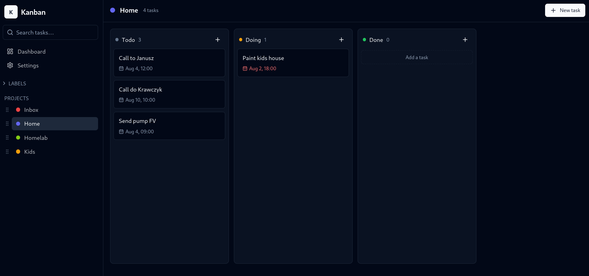
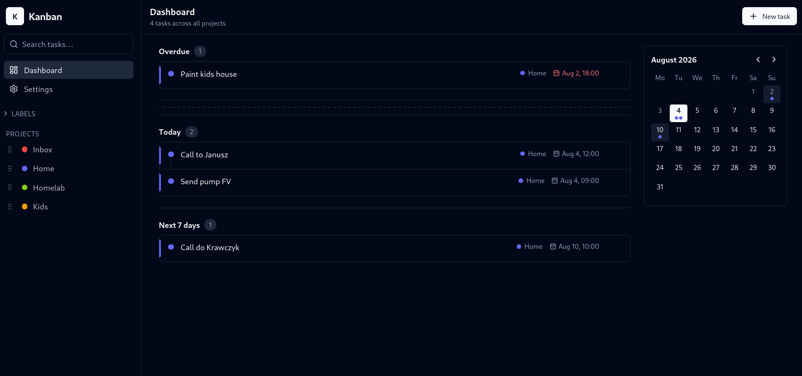
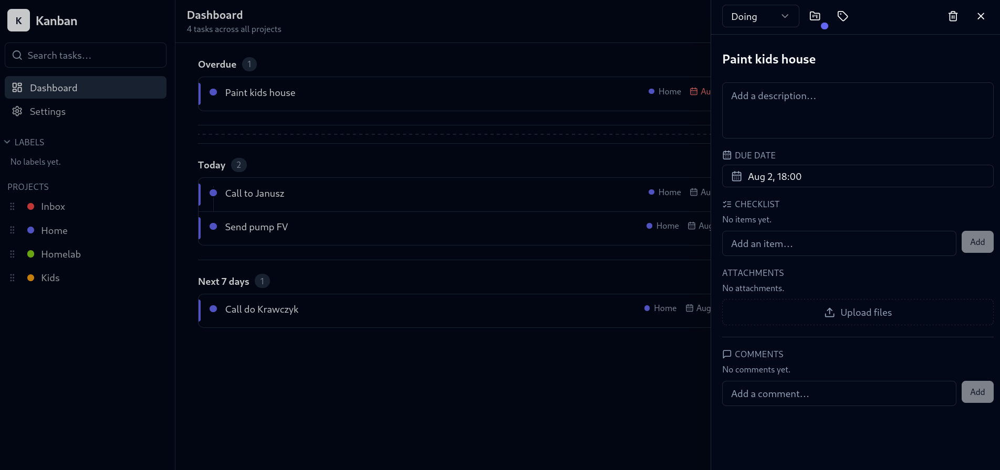
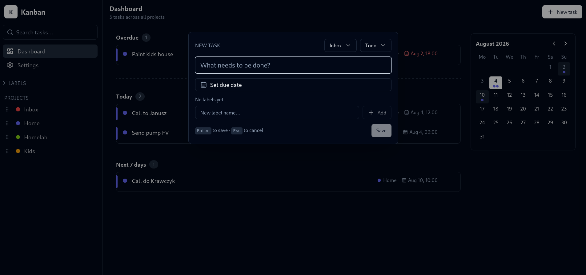

# kanban-board

<p align="center">
  
  
  
  
</p>

I tried a lot of self-hosted kanban boards but never quite liked any of them, so I built my own. This project was created entirely by AI.

## Stack

- **Frontend** — React 19, Vite, TypeScript, Tailwind CSS
- **Backend** — PocketBase (SQLite) with auto-applied migrations
- **Infra** — Docker Compose, images published to GitHub Container Registry
- **Tests** — Playwright e2e run in CI on every commit

## Features

- Drag-and-drop kanban board with columns and projects
- Cards with checklists, labels, comments and attachments
- Dashboard with a timeline and mini calendar
- Quick-create, global search and keyboard shortcuts
- Responsive mobile UI

## Run with Docker Compose

```yaml
services:
  backend:
    image: ghcr.io/pawlikmateusz/kanban-backend:latest
    container_name: kanban-backend
    restart: unless-stopped
    ports:
      - "8090:8080"
    volumes:
      - ./pb_data:/pb_data
    healthcheck:
      test: ["CMD", "wget", "-q", "--spider", "http://localhost:8080/api/health"]
      interval: 5s
      timeout: 3s
      retries: 10

  frontend:
    image: ghcr.io/pawlikmateusz/kanban-frontend:latest
    container_name: kanban-frontend
    restart: unless-stopped
    ports:
      - "5173:80"
    depends_on:
      backend:
        condition: service_healthy
```

```sh
docker compose up -d
```

Open http://localhost:5173. Data is stored in `./pb_data`. The PocketBase admin console is available on http://localhost:8090/_/.
